# La Guía Maestra del NOC a SRE en Sistemas de Pagos Globales
### Handbook Técnico Corporativo — Nivel Principal Engineer
**Clasificación:** Documentación Interna Técnica | **Versión:** 2.0 — Edición Integrada  
**Dominio:** Payments Engineering / Site Reliability Engineering  
**Audiencia:** NOC Operators, SRE Engineers, Payments Engineers, Technical Leads

---

> *"Cuando el teléfono suene a las 3 a.m. y veas un error DE39: 91, no entres en pánico. Respira. Sigue el proceso. Detrás de cada mensaje hay una persona tratando de comprar un café, pagar una cena o hacer una transferencia para llegar a fin de mes. Nuestro trabajo es asegurar que esa experiencia sea invisible y confiable."*

---

## Tabla de Contenidos

1. [Introducción General — Por Qué Este Documento Existe](#1-introducción-general)
2. [Fundamentos del Ecosistema de Pagos](#2-fundamentos-del-ecosistema-de-pagos)
3. [ISO 8583 — El Protocolo Fundacional](#3-iso-8583--el-protocolo-fundacional)
4. [Arquitectura de Alta Disponibilidad](#4-arquitectura-de-alta-disponibilidad)
5. [Observabilidad Elite](#5-observabilidad-elite)
6. [SLO Engineering y Error Budgets](#6-slo-engineering-y-error-budgets)
7. [Logging y Tracing Distribuido](#7-logging-y-tracing-distribuido)
8. [Incident Response — El Proceso Real](#8-incident-response--el-proceso-real)
9. [Incidentes Simulados — Casos de Estudio Reales](#9-incidentes-simulados--casos-de-estudio-reales)
10. [Buenas Prácticas Profesionales](#10-buenas-prácticas-profesionales)
11. [Problemas Comunes y Soluciones](#11-problemas-comunes-y-soluciones)
12. [Roadmap Profesional — De NOC a Staff SRE](#12-roadmap-profesional--de-noc-a-staff-sre)
13. [Glosario Técnico Consolidado](#13-glosario-técnico-consolidado)

---

## 1. Introducción General

### 1.1 Por Qué Este Documento Existe

En sistemas de pagos, la **red equivale a dinero en movimiento**. Cada milisegundo de latencia, cada timeout no gestionado, y cada degradación silenciosa impactan directamente en ingresos, experiencia del usuario y riesgo financiero. Esta realidad convierte al rol de operador de infraestructura de pagos en uno de los perfiles técnicos más críticos y especializados de la industria financiero-tecnológica global.

Este documento ha sido construido para cerrar la brecha que existe entre:

- El **operador de NOC** que monitorea dashboards y sigue runbooks
- El **Site Reliability Engineer de pagos** que diseña sistemas resilientes, define SLOs con impacto de negocio y previene incidentes antes de que ocurran
- El **Staff Engineer** que define la estrategia técnica de confiabilidad a largo plazo para plataformas transaccionales

💡 **Insight profesional:** El conocimiento adquirido desde el NOC sobre fallas reales en producción es un activo diferenciador único. Los comportamientos del sistema bajo presión que un NOC operator observa durante años rara vez aparecen en documentación técnica. Esa experiencia reduce el riesgo organizacional y es irreemplazable durante integraciones corporativas o migraciones de plataforma.

### 1.2 Principio Central de Este Dominio

> **En pagos, la confiabilidad no termina en nuestro data center. Se extiende a través de toda la cadena de procesamiento: POS → Acquirer → Switch → Network → Issuer.**

No operamos máquinas. Operamos dinero en movimiento. Esta distinción no es filosófica: tiene consecuencias técnicas directas en cómo diseñamos alertas, definimos SLOs, respondemos a incidentes y medimos el impacto de nuestras decisiones.

### 1.3 Cómo Usar Este Documento

| Si eres... | Comienza en... | Profundiza en... |
|---|---|---|
| NOC Operator (0-1 año) | Secciones 2, 3, 8 | Sección 9 (casos reales) |
| SRE Junior (1-3 años) | Secciones 4, 5, 6 | Secciones 7, 10 |
| SRE Senior (3+ años) | Sección 11 | Sección 12 (roadmap a Staff) |
| Technical Lead / Staff | Secciones 6, 12 | Todas, como referencia |

---

## 2. Fundamentos del Ecosistema de Pagos

### 2.1 La Cadena Completa de una Transacción

Antes de poder operar o mejorar un sistema de pagos, es imperativo comprender quién interviene en cada transacción y qué responsabilidad técnica tiene cada actor. La siguiente secuencia describe el flujo de una autorización estándar con tarjeta:

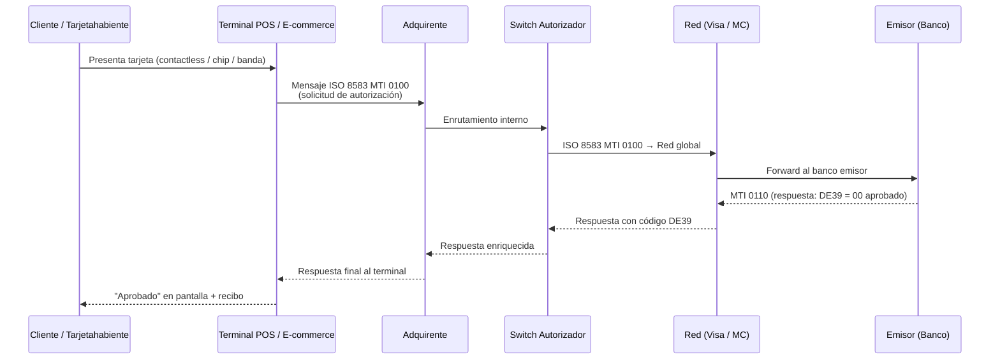

**Tiempo total esperado:** < 2,000 ms en condiciones normales. En sistemas Tier-1: < 500 ms end-to-end P99.

### 2.2 Los Actores del Ecosistema — Guía Técnica Completa

#### Cliente / Tarjetahabiente
El iniciador de la transacción. Desde la perspectiva del SRE, el cliente es el indicador de éxito final: si la transacción se aprueba en tiempo y forma, el cliente tiene una experiencia invisible. Si falla, el impacto es inmediato y medible en métricas de negocio.

#### Comercio / Merchant
Establecimiento que acepta el pago mediante terminal POS físico o plataforma de e-commerce. El comercio puede ser fuente de problemas operativos importantes: terminales mal configuradas, reintentos agresivos, y software de POS desactualizado son causas frecuentes de incidentes.

#### Adquirente
El adquirente es el banco o institución financiera que procesa pagos en nombre del comercio. Es quien conecta el ecosistema del comercio con la red de pago. Técnicamente, el adquirente mantiene:
- La conexión con el switch autorizador interno
- La integración con las redes de pago (Visa, Mastercard, Amex)
- Los procesos de clearing y settlement con los comercios

#### Procesador (Processor)
Algunos adquirentes externalizan la conectividad técnica a procesadores especializados. El procesador actúa como intermediario técnico, manejando traducción de protocolos (ISO 8583 a formatos propietarios), integración con múltiples redes y optimización de enrutamiento.

#### Switch Autorizador
El corazón técnico del sistema adquirente. Es el componente que:
- Recibe mensajes ISO 8583 del POS
- Los enruta a la red correspondiente (Visa, MC, Amex, redes locales)
- Gestiona timeouts, reintentos y reversas
- Mantiene el registro de todas las transacciones

⚠️ **Error común:** Muchos NOC operators confunden el switch con el gateway. El switch maneja el protocolo ISO 8583 en tiempo real; el gateway maneja interfaces REST/HTTP para e-commerce y agrega capas de seguridad como 3D Secure.

#### Red de Pago (Visa / Mastercard / Amex)
La "autopista global" que enruta mensajes entre adquirente y emisor. Desde el punto de vista operativo, la red es una dependencia externa crítica:
- Tiene sus propios SLAs con los adquirentes
- Puede implementar STIP (Stand-In Processing) cuando el emisor no responde
- Genera archivos de clearing y settlement
- Tiene ventanas de mantenimiento y cortes programados

#### Emisor (Issuer)
El banco que emite la tarjeta al cliente y toma la decisión de aprobación o rechazo. El emisor es el actor más variable del ecosistema: diferentes bancos tienen distintas políticas de autorización, tiempos de respuesta, y capacidad de procesamiento. Una degradación del emisor impacta directamente en el ASR (Authorization Success Rate) del adquirente.

#### Gateway de Pagos
Especializado en e-commerce. El gateway:
- Recibe la información de pago desde el navegador del cliente
- Autentica al usuario con 3D Secure (Verified by Visa, Mastercard SecureCode)
- Comunica con el adquirente usando APIs REST
- Tokeniza datos sensibles de tarjeta (PAN → token)

### 2.3 Mapa de Relaciones entre Actores

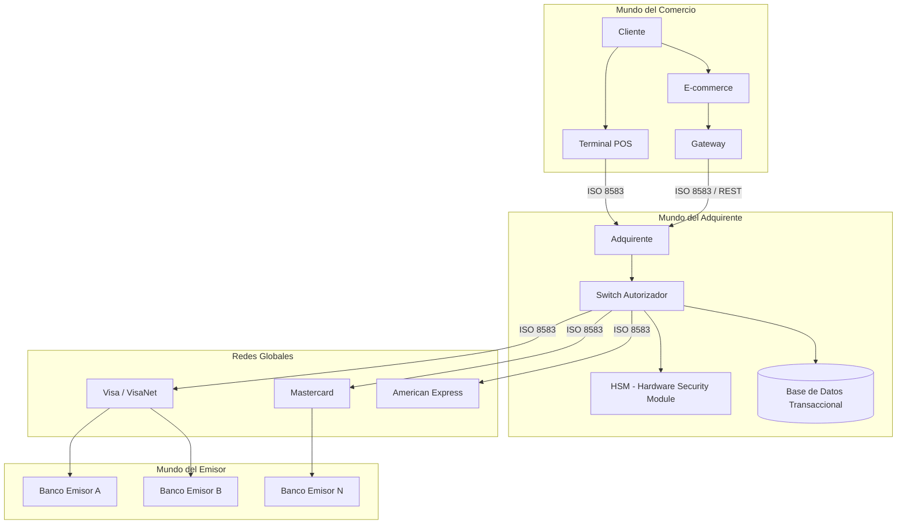

### 2.4 Interfaces Técnicas del Ecosistema

| Interfaz | Protocolo | Uso | Latencia esperada |
|---|---|---|---|
| POS → Adquirente | ISO 8583 sobre TCP/IP | Autorizaciones en tiempo real | < 100 ms (red local) |
| Adquirente → Red | ISO 8583 sobre TCP/IP (TLS) | Enrutamiento de autorización | < 200 ms |
| Red → Emisor | ISO 8583 propietario | Decisión de autorización | < 1,500 ms (incluye lógica de emisor) |
| Gateway → Adquirente | REST/HTTPS + ISO 8583 | E-commerce y MOTO | < 300 ms |
| Sistemas batch | Archivos SFTP (ISO 8583 batch) | Clearing y settlement | Ventana nocturna (2-6 AM) |
| Reporting | REST APIs / SQL | Consultas administrativas | Sin SLA estricto |

### 2.5 Acrónimos y Terminología Crítica

Este glosario operativo es el vocabulario mínimo que todo operador de sistemas de pago debe dominar antes de iniciar su primer turno de guardia:

#### Identificadores de Transacción
| Acrónimo | Nombre Completo | Uso Operativo |
|---|---|---|
| PAN | Primary Account Number | Número de tarjeta. Nunca debe aparecer completo en logs (PCI DSS). Formato: 6 primeros + XXXX + 4 últimos |
| BIN | Bank Identification Number | Primeros 6-8 dígitos del PAN. Identifica al emisor. Clave para routing y STIP |
| STAN | Systems Trace Audit Number | Identificador único de transacción dentro de una sesión. Clave para correlación de logs |
| RRN | Retrieval Reference Number | Referencia para recuperar una transacción en conciliación. Generado por el adquirente |
| ARN | Acquirer Reference Number | Referencia única del adquirente para chargebacks y disputas |

#### Autenticación y Criptografía
| Acrónimo | Nombre Completo | Uso Operativo |
|---|---|---|
| ARQC | Authorisation Request Cryptogram | Firma criptográfica generada por el chip EMV al iniciar la transacción |
| ARPC | Authorisation Response Cryptogram | Respuesta criptográfica del emisor para validar la autenticidad de la respuesta |
| ATC | Application Transaction Counter | Contador en el chip EMV. Incrementa con cada transacción. Detecta tarjetas clonadas |
| TVR | Terminal Verification Results | Resultado del proceso de verificación en el terminal (chip vs. banda, PIN vs. firma) |
| CVV/CVC | Card Verification Value/Code | Código de 3-4 dígitos. CVV1 en banda magnética, CVV2 impreso, iCVV en chip |
| HSM | Hardware Security Module | Dispositivo físico que gestiona claves criptográficas. Punto crítico de fallo |

#### Mensajería y Procesamiento
| Acrónimo | Nombre Completo | Uso Operativo |
|---|---|---|
| MTI | Message Type Indicator | Primeros 4 bytes de un mensaje ISO 8583. Define el tipo y clase del mensaje |
| DE | Data Element | Campo de datos en ISO 8583. Numerados del 1 al 128 (o 192 con bitmap terciario) |
| STIP | Stand-In Processing | Modo de procesamiento alternativo cuando el emisor no está disponible |
| POS | Point of Sale | Terminal física donde se realiza la transacción |
| EMV | Europay, Mastercard, Visa | Estándar de tarjetas con chip inteligente |
| NFC | Near Field Communication | Tecnología de pago sin contacto (contactless) |

---

## 3. ISO 8583 — El Protocolo Fundacional

### 3.1 Conceptos Fundamentales

ISO 8583 es el protocolo de mensajería estándar para transacciones financieras electrónicas. Es el "latín de los pagos": antiguo, verboso, y absolutamente universal en el sector adquirente. Todo operador de sistemas de pago debe poder leer un mensaje ISO 8583 en hexdump durante un incidente P0 a las 3 AM.

✅ **Concepto Clave:** Un mensaje ISO 8583 tiene exactamente tres partes en secuencia obligatoria:
1. **MTI** (4 bytes): qué tipo de mensaje es
2. **Bitmap(s)** (8-16 bytes): qué campos están presentes
3. **Data Elements**: los datos reales de la transacción

### 3.2 Message Type Indicator (MTI)

El MTI es un código de 4 dígitos que identifica completamente el tipo y flujo del mensaje:

```
0  2  0  0
│  │  │  └─ Versión del mensaje (0 = ISO 8583:1987, 1 = 1993, 2 = 2003)
│  │  └──── Clase del mensaje (0 = Autorización, 2 = Financiero, 4 = Reversa, 8 = Gestión de red)
│  └─────── Función del mensaje (0 = Request, 1 = Response, 2 = Advice, 3 = Advice Response)
└────────── Origen del mensaje (0 = Adquirente, 2 = Tarjetahabiente, 4 = Emisor)
```

| MTI | Significado | Dirección |
|---|---|---|
| 0100 | Authorization Request | POS → Adquirente → Red → Emisor |
| 0110 | Authorization Response | Emisor → Red → Adquirente → POS |
| 0120 | Authorization Advice | Adquirente → Red (informativo) |
| 0200 | Financial Request (purchase) | POS → Adquirente |
| 0210 | Financial Response | Adquirente → POS |
| 0400 | Reversal Request | POS → Adquirente (anulación) |
| 0410 | Reversal Response | Adquirente → POS |
| 0800 | Network Management Request | Gestión de sesión ISO 8583 |
| 0810 | Network Management Response | Echo/Sign-on response |

### 3.3 El Bitmap — Cómo Leerlo

El bitmap es un mapa de bits donde cada bit indica si el Data Element correspondiente está presente en el mensaje. El bitmap primario cubre los DEs 1-64; si el bit 1 del bitmap primario está activado, existe un bitmap secundario que cubre los DEs 65-128.

```
Bitmap primario en hex:   70 20 80 00 00 00 00 00
En binario:               0111 0000 0010 0000 1000 0000 0000 0000 ...

Bit 1 = 0 → No hay bitmap secundario
Bit 2 = 1 → DE 2 (PAN) presente
Bit 3 = 1 → DE 3 (Processing Code) presente
Bit 4 = 1 → DE 4 (Amount) presente
Bit 11 = 1 → DE 11 (STAN) presente
Bit 17 = 1 → DE 17 (Capture Date) presente
```

### 3.4 Data Elements Críticos para Operaciones

No todos los 128 DEs son relevantes para operaciones diarias. Estos son los que un operador de NOC debe conocer de memoria:

| DE | Nombre | Longitud | Descripción Operativa |
|---|---|---|---|
| DE 2 | Primary Account Number | Variable (LLVAR) | PAN completo. NUNCA loguear completo. Enmascarar: 6+4 |
| DE 3 | Processing Code | 6 fijos | Tipo de transacción: 00=compra, 20=devolución, 28=consulta saldo |
| DE 4 | Amount, Transaction | 12 fijos | Monto en centavos. $15.00 = 000000001500 |
| DE 7 | Transmission Date & Time | 10 fijos | MMDDhhmmss. Crítico para detectar desfase de reloj (clock skew) |
| DE 11 | STAN | 6 fijos | Número de traza. Clave para correlación de logs entre sistemas |
| DE 12 | Local Transaction Time | 6 fijos | Hora local del terminal |
| DE 13 | Local Transaction Date | 4 fijos | Fecha local del terminal |
| DE 22 | POS Entry Mode | 3 fijos | 051=chip, 071=contactless, 021=banda magnética |
| DE 35 | Track 2 Equivalent Data | Variable | Datos de banda. NUNCA loguear |
| DE 37 | RRN | 12 fijos | Retrieval Reference Number. Generado por el adquirente |
| DE 38 | Authorization ID Response | 6 fijos | Código de autorización del emisor (ej. "123456") |
| DE 39 | Response Code | 2 fijos | El código más importante: 00=aprobado, 05=rechazado, 91=emisor no disponible |
| DE 41 | Card Acceptor Terminal ID | 8 fijos | ID del terminal POS. Clave para aislar un terminal problemático |
| DE 42 | Card Acceptor ID Code | 15 fijos | ID del comercio |
| DE 49 | Currency Code | 3 fijos | ISO 4217: 840=USD, 484=MXN, 840=USD |
| DE 55 | ICC Data | Variable | Datos del chip EMV. Incluye ARQC, ATC, TVR |

### 3.5 Disección Completa de un Mensaje Real

```
Mensaje hex completo:
0200 7020800000000000 16 4543123456789012 001000 000000001500 0626123045 123456

┌─── MTI ──┐ ┌────────── Bitmap (8 bytes) ──────────┐
  0200        70 20 80 00 00 00 00 00
  │           │
  │           Bits activos: 2,3,4,11,17
  │
  Mensaje financiero - solicitud de compra

Campos de datos (en orden de aparición según bitmap):

DE 2:  16 | 4543123456789012  → PAN: 4543 12** **** 9012 (enmascarado)
       └─ longitud (16 dígitos)

DE 3:  001000  → Processing Code:
       00 = compra
       10 = cuenta de débito
       00 = cuenta del titular

DE 4:  000000001500  → Amount: $15.00 USD (en centavos)

DE 11: 123456  → STAN: trace number para correlación de logs

DE 7:  0626123045  → Fecha/Hora: 06/26 12:30:45 UTC
```

### 3.6 Códigos de Respuesta DE39 — Referencia Operativa Completa

Los códigos DE39 son la columna vertebral del diagnóstico de transacciones. Durante un incidente, el análisis de la distribución de códigos DE39 por emisor, red y terminal es el primer paso de cualquier investigación:

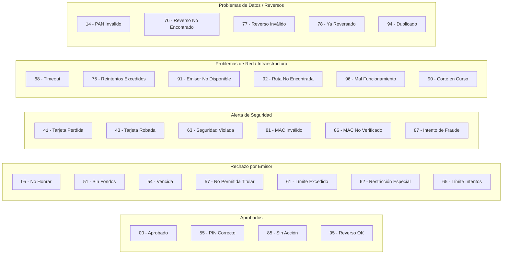

| Código | Estado | Significado Operativo | Acción del SRE |
|---|---|---|---|
| 00 | Aprobado | Transacción autorizada exitosamente | Baseline normal |
| 05 | Rechazado | No honrar — decisión del emisor | Monitorear ratio. Si sube abruptamente: alerta |
| 14 | Rechazado | PAN inválido — formato de tarjeta incorrecto | Revisar configuración del POS o gateway |
| 41 | Alerta | Tarjeta reportada perdida | Log de seguridad. Alertar al equipo de fraude |
| 43 | Alerta | Tarjeta robada — riesgo alto | Log de seguridad inmediato. Posible fraude activo |
| 51 | Rechazado | Fondos insuficientes | Normal. Monitorear si supera baseline |
| 54 | Rechazado | Tarjeta vencida | Normal. Alto volumen puede indicar carga masiva de tarjetas viejas |
| 57 | Rechazado | Transacción no permitida al titular | Revisar tipo de transacción vs. restricciones de BIN |
| 61 | Rechazado | Límite de monto excedido | Normal. Revisar si hay spike inusual |
| 68 | Error | Timeout de red — respuesta tardía | **CRÍTICO:** inicio de investigación. ¿Qué emisor? ¿Qué red? |
| 75 | Rechazado | Límite de reintentos PIN alcanzado | Normal, pero spike puede indicar ataque de fuerza bruta |
| 76 | Error | Reverso no encontrado — inconsistencia de estado | Investigar. Puede indicar bug en manejo de STAN |
| 81 | Error | MAC inválido — firma criptográfica corrupta | **CRÍTICO:** posible corrupción de red o ataque. Escalar |
| 85 | Normal | No hay acción requerida | Respuesta a pre-authorización o verificación |
| 90 | Temporal | Corte de tarjeta en curso | Ventana de mantenimiento. Verificar horario de batch |
| 91 | Error | Emisor no disponible — timeout hacia el banco | **CRÍTICO:** activar STIP. Monitorear ASR por BIN |
| 92 | Error | Ruta no encontrada | Revisar tabla de routing. ¿BIN configurado? |
| 94 | Error | Transacción duplicada detectada | Revisar lógica de generación de STAN |
| 96 | Error | Mal funcionamiento del sistema | Error genérico. Revisar logs del switch |

### 3.7 Captura y Decodificación de Mensajes — Mini Workshop Operativo

En producción, la capacidad de capturar y decodificar tráfico ISO 8583 es una habilidad de supervivencia para el SRE de pagos:

**Paso 1: Captura de tráfico con tcpdump**
```bash
# Capturar tráfico en el puerto del switch (común: 5000-6000, varían por implementación)
tcpdump -i eth0 -w /tmp/capture_iso8583.pcap tcp port 5500

# Filtrar solo hacia una IP específica (red de Visa, por ejemplo)
tcpdump -i eth0 -w /tmp/visa_traffic.pcap tcp dst host 10.20.30.40
```

**Paso 2: Análisis con Wireshark**
```bash
# Aplicar filtro ISO 8583 en Wireshark
# En el campo de filtro: tcp.port == 5500
# Wireshark tiene decodificador ISO 8583 si se configura el disector correcto
```

**Paso 3: Parser en Python para análisis automatizado**
```python
# Usando la librería iso8583 de Python
import iso8583
from iso8583.specs import default_ascii as spec

raw_message = bytes.fromhex('0200702080000000000016454312345678901200100000000000150006261230451234561234')
decoded, encoded = iso8583.decode(raw_message, spec)

print(f"MTI: {decoded.get('t')}")
print(f"DE2 (PAN): {decoded.get('2', 'N/A')[:6]}XXXXXX{decoded.get('2', 'N/A')[-4:]}")
print(f"DE4 (Amount): ${int(decoded.get('4', '0')) / 100:.2f}")
print(f"DE11 (STAN): {decoded.get('11')}")
print(f"DE39 (Response): {decoded.get('39')}")
```

📌 **Buenas prácticas:** Durante un incidente, nunca captures más de 60 segundos de tráfico sin comprimir y rotar. Los volúmenes en hora pico pueden ser varios GB por minuto. Usa filtros específicos por STAN o BIN para acotar la captura.

---

## 4. Arquitectura de Alta Disponibilidad

### 4.1 El Estándar de Disponibilidad en Pagos

En sistemas de pagos Tier-1, la disponibilidad del 99.99% no es un objetivo aspiracional: es un requisito contractual. La matemática es implacable:

| SLA | Downtime Permitido (Mensual) | Downtime Permitido (Anual) |
|---|---|---|
| 99.9% ("tres nueves") | 43.8 minutos | 8.7 horas |
| 99.95% | 21.9 minutos | 4.4 horas |
| 99.99% ("cuatro nueves") | 4.4 minutos | 52.6 minutos |
| 99.999% ("cinco nueves") | 26.3 segundos | 5.3 minutos |

> Para un sistema procesando 10,000 TPS con ticket promedio de $50 y comisión del 1.5%: **cada minuto de caída cuesta $6,000 USD en comisiones perdidas**. Un incidente de 30 minutos = $180,000 USD. Esta matemática es lo que convierte a SRE de pagos en un rol estratégico de negocio.

### 4.2 Patrones de Alta Disponibilidad

#### Patrón 1: Activo-Pasivo (Tradicional — Obsoleto para Pagos de Alto Valor)

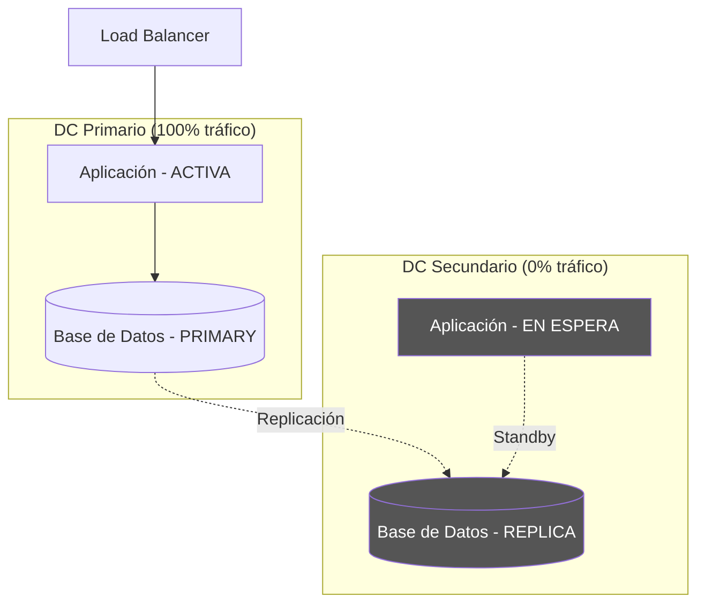

**Limitaciones críticas para pagos:**
- Failover toma entre 2-15 minutos (cambio de DNS, reconexión de clientes, warmup de aplicación)
- Durante el failover, las transacciones en vuelo se pierden
- Las terminales POS pueden desconectarse y requerir reconexión manual
- **INACEPTABLE para sistemas de pago de alto valor**

#### Patrón 2: Active-Active Real (Estándar de la Industria)

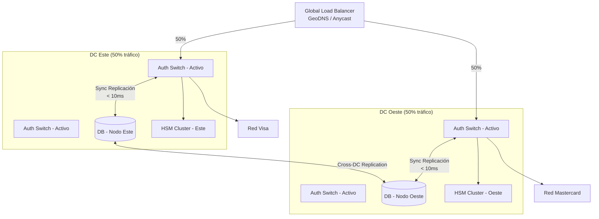

**Características del Active-Active verdadero:**
- Ambos DCs reciben y procesan tráfico simultáneamente
- La conmutación ante un fallo tarda **milisegundos** (re-enrutamiento del balanceador)
- Las transacciones en vuelo del DC afectado son completadas por el DC alternativo
- El desafío principal es la consistencia de estado (transacciones duplicadas, reversas huérfanas)

💡 **Insight profesional:** El Active-Active "real" requiere resolver el problema de la consistencia distribuida (CAP theorem). En pagos, generalmente se sacrifica consistencia eventual por disponibilidad, usando mecanismos de reconciliación posteriores para corregir discrepancias.

#### Patrón 3: Active-Active con Circuit Breaker

```mermaid
stateDiagram-v2
    [*] --> Closed : Sistema iniciado
    Closed --> Open : Error rate > umbral\n(ej: >5% en 60s)
    Open --> HalfOpen : Tiempo de cooldown\n(ej: 30 segundos)
    HalfOpen --> Closed : Prueba exitosa
    HalfOpen --> Open : Prueba fallida

    state Closed {
        description: Tráfico normal.\nRequests fluyen al emisor.
    }
    state Open {
        description: Emisor considerado caído.\nActivar STIP o rechazar.
    }
    state HalfOpen {
        description: Enviar 1 request de prueba.\nEvaluar resultado.
    }
```

### 4.3 Stand-In Processing (STIP) — Operaciones Detalladas

STIP es el mecanismo de degradación elegante para el ecosistema de pagos. Cuando la red no puede contactar al emisor, puede aprobar transacciones en "modo suplente" basándose en reglas y límites predefinidos.

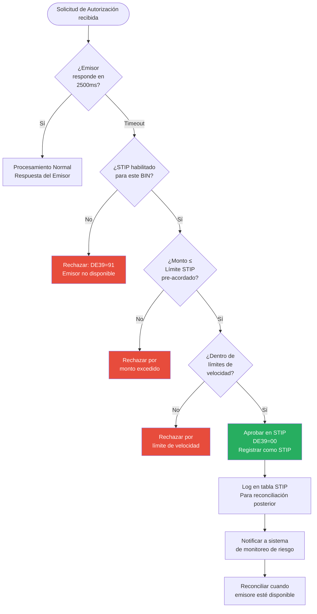

**Parámetros de configuración de STIP por BIN:**

| Parámetro | Descripción | Valor Típico |
|---|---|---|
| `stip_enabled` | Si STIP está activado para este BIN | true/false por BIN |
| `max_amount` | Monto máximo aprobable en STIP | $50-$200 USD (varía por emisor) |
| `velocity_limit_count` | Máximo de transacciones STIP por tarjeta por hora | 3-5 transacciones |
| `velocity_limit_amount` | Monto total STIP por tarjeta por día | $100-$500 USD |
| `exclude_mcc` | Categorías de comercio excluidas de STIP | MCC de alto riesgo |
| `require_chip` | Solo aplicar STIP a transacciones con chip (EMV) | true recomendado |

### 4.4 Chaos Engineering en Sistemas de Pago

Probar la resiliencia del sistema antes de que un fallo real lo haga es la filosofía central del Chaos Engineering. En pagos, esto requiere un nivel de cuidado adicional por el impacto financiero directo de los fallos.

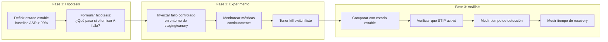

**Escenarios de Chaos Engineering para sistemas de pago:**

| Experimento | Herramienta | Qué se valida |
|---|---|---|
| Desconexión de emisor simulado | Gremlin / tc netem | STIP activa automáticamente |
| Latencia artificial en red | Chaos Mesh / tc qdisc | Timeouts y reintentos correctos |
| Saturación de conexiones al HSM | Chaos Monkey / Pumba | Rate limiting y circuit breaker |
| Fallo de nodo de base de datos | Chaos Mesh | Failover de DB y consistencia |
| Corrupción de respuesta de red | Proxy de inyección | Manejo de MAC inválido |
| Agotamiento de memoria en switch | Stress-ng | Comportamiento bajo OOM |
| Rollover de STAN (23:59:59 → 00:00:00) | Script personalizado | Lógica de generación de STAN |

### 4.5 MTBF y MTTR — Métricas de Confiabilidad

```
MTBF (Mean Time Between Failures)
────────────────────────────────────────────────────────
                     Tiempo Total de Operación
MTBF =  ─────────────────────────────────────────────────
                       Número de Fallos

Ejemplo práctico:
  Operación: 30 días × 24h = 720 horas
  Fallos: 3 incidentes
  MTBF = 720 / 3 = 240 horas (10 días)

  Objetivo Tier-1 de pagos: MTBF > 2,000 horas
────────────────────────────────────────────────────────

MTTR (Mean Time To Recover)
────────────────────────────────────────────────────────
                     Tiempo Total de Recuperación
MTTR =  ─────────────────────────────────────────────────
                       Número de Fallos

Ejemplo práctico:
  Incidente 1: 15 min | Incidente 2: 30 min | Incidente 3: 45 min
  MTTR = 90 / 3 = 30 minutos

  Objetivo Tier-1 de pagos: MTTR < 15 minutos para P1
                            MTTR < 5 minutos para P0
────────────────────────────────────────────────────────
```

---

## 5. Observabilidad Elite

### 5.1 La Trinidad de la Observabilidad

Métricas, logs y trazas no son herramientas separadas: son tres dimensiones complementarias para entender el comportamiento de un sistema distribuido. Ninguna es suficiente por sí sola.

```mermaid
graph TD
    subgraph "MÉTRICAS — ¿Qué está pasando?"
        M1[ASR — Authorization Success Rate]
        M2[Latencia P50, P95, P99]
        M3[TPS — Transactions Per Second]
        M4[Error Budget Burn Rate]
    end
    
    subgraph "LOGS — ¿Por qué está pasando?"
        L1[Logs estructurados JSON por transacción]
        L2[Logs de error con stack trace]
        L3[Audit logs de seguridad]
        L4[Correlación por STAN / trace_id]
    end
    
    subgraph "TRAZAS — ¿Dónde está pasando?"
        T1[Span: POS → Switch]
        T2[Span: Switch → HSM]
        T3[Span: Switch → Red]
        T4[Span: Red → Emisor]
    end
    
    INCIDENTE([Investigación de Incidente])
    M1 --> INCIDENTE
    M2 --> INCIDENTE
    L1 --> INCIDENTE
    L4 --> INCIDENTE
    T3 --> INCIDENTE
    T4 --> INCIDENTE
```

### 5.2 SLIs Específicos de Pagos — Definición y Umbales

Los SLIs (Service Level Indicators) en pagos son fundamentalmente distintos a los de sistemas web tradicionales. No medimos "disponibilidad del servidor": medimos el éxito funcional de las transacciones.

#### Authorization Success Rate (ASR)
El SLI más importante en cualquier sistema adquirente. Mide el porcentaje de solicitudes de autorización que resultaron en una aprobación (DE39=00) sobre el total de solicitudes recibidas.

```
ASR = (Transacciones aprobadas / Total de solicitudes) × 100

ASR típico en sistema saludable: 88-95% (varía por país, industria, base de tarjetahabientes)
ASR de alerta: caída de >2% respecto al baseline en ventana de 5 minutos
ASR de incidente P0: caída de >10% respecto al baseline
```

⚠️ **Error común:** Confundir ASR con "tasa de disponibilidad". El sistema puede estar 100% disponible técnicamente y tener un ASR del 70% por un problema en el emisor. Son métricas distintas.

#### Métricas Completas por Categoría

| Categoría | SLI | Descripción | Umbral de Alerta |
|---|---|---|---|
| **Autorización** | ASR Global | % aprobaciones totales | Δ > 2% en 5 min |
| **Autorización** | ASR por Emisor | % aprobaciones filtrado por BIN | Δ > 5% en 3 min |
| **Autorización** | ASR por Red | % aprobaciones por Visa/MC/Amex | Δ > 3% en 5 min |
| **Latencia** | End-to-end P99 | Tiempo total POS-respuesta | > 500 ms |
| **Latencia** | Network Latency P99 | Tiempo switch → red → respuesta | > 300 ms |
| **Latencia** | Switch Processing P99 | Tiempo interno del switch | > 50 ms |
| **Latencia** | HSM Call P99 | Tiempo de operación criptográfica | > 20 ms |
| **Integridad** | Reversal Ratio | Reversas / Aprobaciones | > 2% |
| **Integridad** | Duplicate Rate | Transacciones duplicadas / Total | > 0.01% |
| **Conectividad** | Network Uptime | % tiempo con conexión activa a cada red | < 99.99% |
| **Recursos** | HSM Remaining Keys | Claves disponibles en HSM | < 10% |
| **Recursos** | DB Connection Pool | % conexiones en uso | > 80% |

### 5.3 Dashboards en Grafana — Anatomía de un Dashboard Elite

Un dashboard de pagos no es solo gráficas bonitas. Es la diferencia entre detectar un incidente en 30 segundos o en 5 minutos.

**Panel 1: ASR Global — La Métrica de Vida o Muerte**
```
Tipo: Time Series + Stat
Período: Últimos 60 minutos, refresh cada 15 segundos
Líneas:
  - ASR Actual (línea verde gruesa)
  - SLO Target: 99.95% (línea punteada azul)
  - Alerta Burn Rate (línea roja punteada)
Anotaciones automáticas: deploys, cambios de configuración
```

**Panel 2: Latencia P99 por Red — Heatmap de Degradación**
```
Tipo: Heatmap
Ejes: Y = latencia (0-3000ms), X = tiempo, Color = densidad
Múltiples filas: Visa | Mastercard | Amex | Emisores directos
Permite ver degradación gradual que las alertas de umbral no capturan
```

**Panel 3: Top 5 Emisores con Mayor Degradación**
```
Tipo: Table (actualización cada 60 segundos)
Columnas: Emisor | BIN | ASR actual | Baseline | Δ% | Volumen | Estado
Ordenado por: Mayor degradación primero
Color condicional: Verde > 95%, Amarillo 90-95%, Rojo < 90%
```

**Panel 4: TPS vs. Volumen Aprobado — El Dinero que No Ganamos**
```
Tipo: Time Series (dual axis)
Línea 1: TPS total recibido (eje izquierdo)
Línea 2: TPS aprobado (eje izquierdo)
Área sombreada: La brecha entre ambas líneas = dinero no ganado
Línea 3: ASR % (eje derecho)
```

### 5.4 Mini Recetario de PromQL para Pagos

```promql
# ─── ASR Global en última hora ───────────────────────────────────────
sum(rate(auth_requests_total{status="approved"}[1h]))
/ sum(rate(auth_requests_total[1h]))

# ─── ASR por Emisor (top 10 degradados) ──────────────────────────────
topk(10,
  sum by(issuer_name, bin) (rate(auth_requests_total{status="approved"}[5m]))
  / sum by(issuer_name, bin) (rate(auth_requests_total[5m]))
)

# ─── Latencia P99 por Red ─────────────────────────────────────────────
histogram_quantile(0.99,
  sum by(le, network_name) (rate(transaction_duration_seconds_bucket[5m]))
) * 1000  # convertir a ms

# ─── Tasa de Reversos por Comercio ───────────────────────────────────
sum by(merchant_id) (rate(reversals_total[1h]))
/ sum by(merchant_id) (rate(approvals_total[1h]))

# ─── Burn Rate de Error Budget (alerta si consume budget < 2h) ────────
(
  sum(rate(auth_errors_total{service="auth-switch"}[1h]))
  / sum(rate(auth_requests_total{service="auth-switch"}[1h]))
) > bool (1 - 0.9995) * 14.4

# ─── Detección de Tormenta de Reintentos ─────────────────────────────
# Si el mismo STAN aparece más de 3 veces en 5 minutos
increase(auth_requests_total{stan=~".+"}[5m]) > 3

# ─── HSM Keys Remaining (alerta crítica) ─────────────────────────────
hsm_keys_remaining / hsm_keys_total < 0.10

# ─── Detector de Clock Skew entre DCs ────────────────────────────────
abs(
  avg(node_time_seconds{dc="east"}) 
  - avg(node_time_seconds{dc="west"})
) > 0.1  # más de 100ms de diferencia = alerta
```

### 5.5 Alertas: La Diferencia entre Buenas y Malas

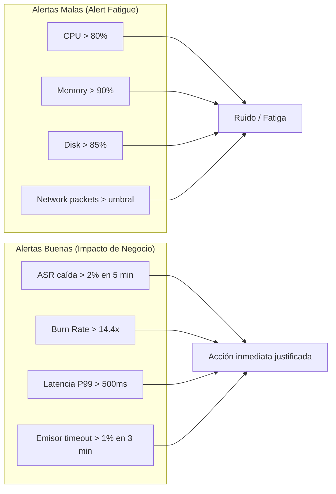

📌 **Buenas prácticas de alertas:**
- Cada alerta debe tener un runbook asociado
- Toda alerta debe poder responderse: "¿qué hago cuando esto salta?"
- Si una alerta salta más de 3 veces sin acción diferente, necesita ser modificada o eliminada
- El objetivo de las alertas no es informar: es activar una acción específica

---

## 6. SLO Engineering y Error Budgets

### 6.1 El Marco Conceptual Completo

Los SLOs son la herramienta de gestión que equilibra la velocidad de innovación con la confiabilidad del sistema. Entender su mecánica completa es un diferenciador clave entre un NOC operator y un SRE.

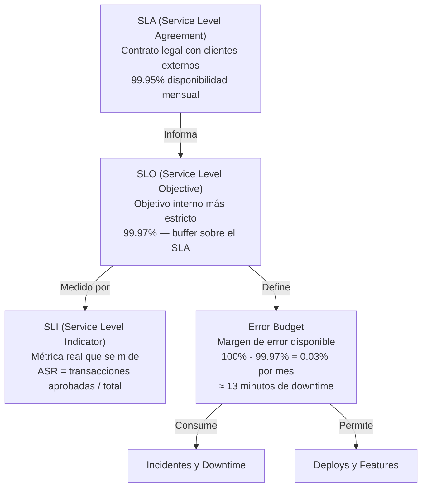

💡 **Insight profesional:** El SLO siempre debe ser más estricto que el SLA. Si el SLA dice 99.95%, el SLO interno debe ser 99.97% o más. Esto crea un buffer que permite absorber incidentes reales sin violar el contrato con el cliente.

### 6.2 Definición de SLOs por Criticidad de Servicio

| Servicio | Criticidad | SLO | Error Budget Mensual | Política de Burn Rate |
|---|---|---|---|---|
| Core Authorizations (tiempo real) | P0 — Crítico | 99.95% | 21.9 minutos | Alerta inmediata a burn rate > 2x |
| HSM Operations | P0 — Crítico | 99.99% | 4.4 minutos | Alerta crítica a cualquier degradación |
| Batch Liquidación (completar en < 2h) | P1 — Alto | 99.9% | 43.8 minutos | Alerta si no completa en 1.5h |
| Tasa de éxito de archivos batch | P1 — Alto | 99.95% | 21.9 minutos | Alerta inmediata a cualquier fallo |
| Integridad de datos (sumas cuadradas) | P0 — Crítico | 100% | 0 segundos | Alerta inmediata + escalación |
| APIs de Reporting | P3 — Bajo | 99.5% | ~3.6 horas | Alerta solo en horas hábiles |
| Paneles de Administración | P3 — Bajo | 99% | ~7.3 horas | Ticket en siguiente sprint |
| Network Connectivity (Visa/MC) | P0 — Crítico | 99.99% | 4.4 minutos | Alerta inmediata |

### 6.3 Error Budget — La Mecánica Detallada

```
Cálculo del Error Budget Mensual para ASR con SLO 99.95%:

  Minutos en un mes: 30 días × 24h × 60min = 43,200 minutos
  
  Error Budget = (1 - 0.9995) × 43,200 = 21.6 minutos
  
  Si el sistema procesa 10,000 TPS:
  Transacciones en un mes = 10,000 × 60 × 43,200 = 25,920,000,000 tx
  Error Budget en transacciones = 25,920,000,000 × 0.0005 = 12,960,000 tx fallidas permitidas
```

### 6.4 Política de Burn Rate — Cuándo y Cómo Actuar

El Burn Rate mide qué tan rápido se está consumiendo el error budget. Un Burn Rate de 1x significa que se consume exactamente al ritmo que se regenera (fin de mes = budget agotado). Un Burn Rate de 14.4x significa que el budget mensual se agotaría en 2 horas.

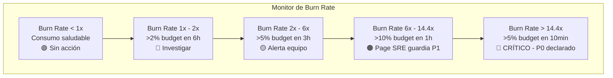

**Fórmula de Burn Rate en PromQL:**
```promql
# Burn Rate de 1 hora para SLO del 99.95%
(
  sum(rate(auth_errors_total[1h]))
  / sum(rate(auth_requests_total[1h]))
) / (1 - 0.9995)

# Alerta de burn rate crítico (>14.4x = budget agotado en < 2 horas)
(
  sum(rate(auth_errors_total[1h]))
  / sum(rate(auth_requests_total[1h]))
) > (1 - 0.9995) * 14.4
```

### 6.5 Matriz de Decisión de Error Budget

| Budget Consumido | Acción Técnica Inmediata | Acción de Negocio |
|---|---|---|
| 0 - 10% | Revisión de cambios recientes desplegados | Monitoreo aumentado |
| 10 - 25% | Freeze de lanzamientos no críticos | Reunión con equipo de Producto |
| 25 - 50% | Reunión de emergencia del equipo SRE | Comunicación a dirección técnica |
| 50 - 75% | Activar plan de DR / rollback | Comunicación ejecutiva y a clientes clave |
| 75 - 100% | Investigación profunda de causa raíz + postmortem | Revisión de SLA con clientes + posibles penalizaciones |
| > 100% | SLA violado. Análisis de daño y acuerdo con clientes | Revisión contractual. Posibles créditos o penalizaciones |

### 6.6 SLA Real con Cliente — De Contrato a SLOs Técnicos

```
Cláusula de SLA del contrato con cliente grande:
  • Disponibilidad: 99.95% mensual
  • Latencia P99: < 500ms
  • MTTR máximo: < 30 minutos
  • Notificación de incidente: < 15 minutos desde detección

Traducción a SLOs y alertas técnicas internas:
  • SLO ASR: > 99.97% (buffer de 0.02% sobre el SLA)
  • Alerta latencia: P99 > 250ms (buffer de 250ms sobre el SLA)
  • Alerta de incidente: Page en < 5 minutos (buffer de 10 minutos)
  • SLO MTTR interno: < 15 minutos (buffer de 15 minutos sobre el SLA)

Penalizaciones contractuales:
  • 99.9% - 99.95%: 5% de descuento en facturación mensual
  • 99.5% - 99.9%: 15% de descuento
  • < 99.5%: 30% de descuento
  • Incidente P0 declarado: 20% de descuento adicional
```

---

## 7. Logging y Tracing Distribuido

### 7.1 El Problema: ¿Por Qué el Logging Estructurado Es Obligatorio?

En un sistema de pagos, una transacción puede pasar por 8-12 sistemas distintos antes de recibir una respuesta. Si no puedes correlacionar una transacción a través de todos esos sistemas, no puedes diagnosticar el problema cuando falla.

El objetivo es poder responder esta pregunta en < 2 minutos durante un incidente: **"¿Por qué falló la transacción con STAN 123456 para el comercio XYZ a las 14:32:10?"**

### 7.2 Formato de Log Estándar — Especificación Técnica

Todo servicio en el ecosistema de pagos DEBE loguear en JSON estructurado con los siguientes campos:

```json
{
  "timestamp": "2024-05-20T14:32:10.123Z",
  "level": "ERROR",
  "service": "authorization-switch",
  "version": "2.4.1",
  "dc": "us-east-1",
  "host": "auth-switch-pod-7d9f4b",
  "trace_id": "abc123def456ghi789",
  "span_id": "def456",
  "parent_span_id": "abc123",
  "transaction_id": "STAN-123456",
  "rrn": "240520143210",
  "message": "Timeout esperando respuesta de Visa",
  "error_code": "TIMEOUT_NETWORK",
  "error_category": "connectivity",
  "duration_ms": 2500,
  "metadata": {
    "bin": "454312",
    "network": "VISA",
    "mti": "0210",
    "response_code": "91",
    "terminal_id": "TERM0042",
    "merchant_id": "MERCH001234"
  }
}
```

**Campos obligatorios explicados:**

| Campo | Propósito | Restricciones PCI |
|---|---|---|
| `timestamp` | Correlación temporal. SIEMPRE en UTC con milisegundos | Ninguna |
| `trace_id` | Correlación técnica entre servicios (OpenTelemetry) | Ninguna |
| `transaction_id` (STAN) | Correlación de negocio entre sistemas legacy y modernos | Ninguna |
| `bin` | Primeros 6 dígitos del PAN. Para diagnóstico de emisor | Permitido (no es PAN completo) |
| PAN | Número completo de tarjeta | **PROHIBIDO** en logs. Solo 6+4 enmascarado |
| PIN / CVV | Datos de autenticación | **PROHIBIDO** absolutamente |
| `track2` / `track1` | Datos de banda magnética | **PROHIBIDO** en logs |

### 7.3 Tracing Distribuido con OpenTelemetry — Arquitectura Completa

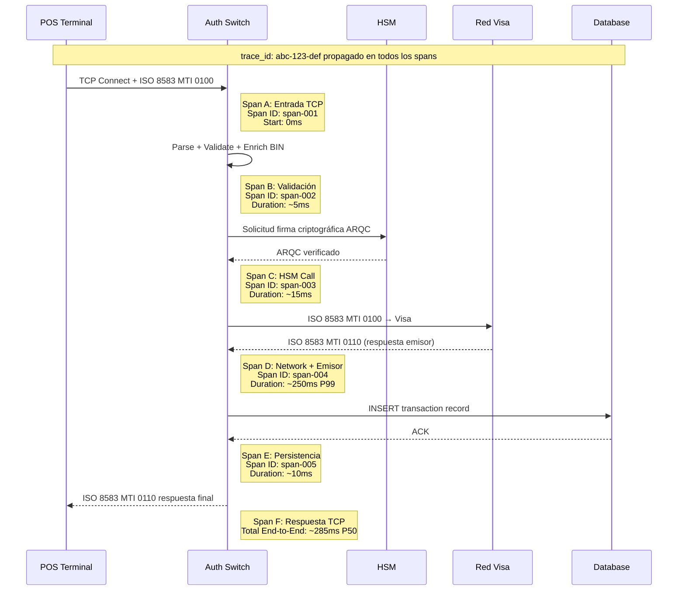

**Objetivos de latencia por span:**

| Span | Componente | P50 | P95 | P99 | Alerta |
|---|---|---|---|---|---|
| A | Entrada TCP | 2 ms | 5 ms | 10 ms | > 50 ms |
| B | Validación/Enriquecimiento | 3 ms | 8 ms | 20 ms | > 100 ms |
| C | HSM Call | 5 ms | 12 ms | 20 ms | > 50 ms |
| D | Network + Emisor | 80 ms | 180 ms | 300 ms | > 500 ms |
| E | Persistencia DB | 5 ms | 15 ms | 25 ms | > 100 ms |
| **Total** | **End-to-End** | **100 ms** | **220 ms** | **375 ms** | **> 500 ms** |

### 7.4 Propagación de Contexto en Sistemas Legacy

El mayor desafío del tracing distribuido en pagos es que los sistemas legacy (switch autorizador, procesadores antiguos) no soportan headers HTTP de propagación como `traceparent` (W3C TraceContext). La solución:

```
Sistema Moderno (API Gateway) 
  └─ Inyecta: W3C traceparent header
        ↓ Al traducir a ISO 8583
Legacy ISO 8583 Switch
  └─ Extrae trace_id y lo inyecta en DE 48 (campo privado / uso propio)
        ↓ En el siguiente hop
Sistema de Base de Datos / Archivos
  └─ Lee trace_id de DE 48 y lo incluye en logs propios
```

### 7.5 Correlación de Logs en Producción — Flujo de Investigación

Durante un incidente, este es el procedimiento de correlación usando el STAN:

```bash
# 1. El equipo de soporte reporta: "Transacción STAN-123456 falló"
# 2. Buscar en todos los sistemas usando el STAN

# Búsqueda en Kibana / Loki
{service="authorization-switch"} |= "STAN-123456"

# Output esperado (ordenado por timestamp):
# 2024-05-20T14:32:10.123Z - authorization-switch - Recibida solicitud STAN-123456
# 2024-05-20T14:32:10.150Z - hsm-service - Solicitud firma para STAN-123456
# 2024-05-20T14:32:10.165Z - hsm-service - Firma generada para STAN-123456
# 2024-05-20T14:32:10.200Z - authorization-switch - Enviado a Visa STAN-123456
# 2024-05-20T14:32:12.700Z - authorization-switch - TIMEOUT esperando Visa STAN-123456 [2500ms]
# 2024-05-20T14:32:12.710Z - authorization-switch - DE39=91 enviado al POS STAN-123456
```

### 7.6 Buenas Prácticas de Logging para PCI DSS

| Práctica | Descripción | Consecuencia de No Cumplir |
|---|---|---|
| **Enmascarar PAN** | Mostrar solo 6 primeros + 4 últimos dígitos | Violación PCI DSS Req. 3.4. Multas |
| **No loguear PIN** | El PIN NUNCA debe aparecer en logs | Violación crítica de seguridad. Auditoría fallida |
| **No loguear track data** | DE 35 (Track 2) y DE 45 (Track 1) nunca en logs | Violación PCI DSS |
| **Rotación diaria** | Logs rotados cada 24h y archivados | PCI DSS Req. 10.5 |
| **Cifrado en reposo** | Logs cifrados con AES-256 en almacenamiento | PCI DSS Req. 10.5.1 |
| **Retención mínima** | Conservar logs accesibles por 3 meses + archivados 12 meses | PCI DSS Req. 10.7 |
| **Acceso auditado** | Log de quién accede a los logs de transacciones | PCI DSS Req. 10.2 |
| **Integridad** | Hash de logs para detectar manipulación | PCI DSS Req. 10.5.2 |

---

## 8. Incident Response — El Proceso Real

### 8.1 El Flujo Completo de un Incidente P0

```mermaid
flowchart TD
    ALERT([Alerta dispara PagerDuty / OpsGenie]) --> ONCALL{On-call recibe\nel pager}
    ONCALL --> ACK[ACK dentro de 5 minutos\nSi no responde → escalación]
    ACK --> TRIAGE{Evaluación inicial:\n¿Qué tan malo es?}
    
    TRIAGE -->|Solo yo afectado| SOLO[Seguir runbook\nSolo se trabaja]
    TRIAGE -->|Impacto regional| P2[Declarar P2\nEquipo notificado]
    TRIAGE -->|Impacto global / múltiples comercios| P0[Declarar P0\nActivar war room]
    
    P0 --> IC[Nombrar Incident Commander\nIC coordina. NO debuggea]
    IC --> CHANNEL[Crear canal #incident-YYYYMMDD-HHMMSS\nEn Slack / Teams]
    CHANNEL --> ROLES[Asignar roles:\nIC + Scribe + Comms Lead + Tech Lead]
    
    ROLES --> COMMS[Comunicación inicial:\n"Investigando P0. Update en 15 min."]
    COMMS --> PARALLEL{Trabajo paralelo}
    
    PARALLEL -->|Técnico| DEBUG[Technical Lead + equipo\ndebuggeando causa raíz]
    PARALLEL -->|Comunicación| UPDATE[Comms Lead actualiza\ncada 15 minutos]
    PARALLEL -->|Documentación| SCRIBE[Scribe documenta\ncada acción y decisión]
    
    DEBUG --> MITIGATE{¿Se encontró\nmitigación?}
    MITIGATE -->|No| DEBUG
    MITIGATE -->|Sí — con rollback plan| APPLY[Aplicar mitigación\nMonitorear 10 min]
    
    APPLY --> STABLE{¿Métricas\nestabilizadas?}
    STABLE -->|No| ROLLBACK[Rollback de mitigación\nVolver a investigar]
    STABLE -->|Sí| RESOLVE[Declarar resolución\nUpdatecomunicación]
    
    RESOLVE --> POSTMORTEM[Postmortem en 48h\nBlameless]
```

### 8.2 Severidades de Incidentes — Basadas en Impacto Económico

La severidad en pagos NO se basa en la gravedad técnica del error: se basa en el impacto económico y operativo al negocio.

| Severidad | Disparador | Impacto Económico | Tiempo de Respuesta | Escalación |
|---|---|---|---|---|
| **P0** | Caída total del servicio. ASR < 70%. Múltiples comercios. | > $50K/hora | Inmediata (< 5 min) | CEO en < 15 min |
| **P1** | Degradación severa. Emisor importante caído. Lote fallido. | > $10K/hora | Inmediata (< 5 min) | Dirección técnica |
| **P2** | Error funcional no crítico. Latencia elevada en subconjunto. | < $5K/hora | < 30 minutos (horas hábiles) | Manager del equipo |
| **P3** | Error cosmético en UI. Alerta ruidosa sin impacto real. | $0 | < 24 horas | Ticket en backlog |

### 8.3 Roles en un Incidente P0

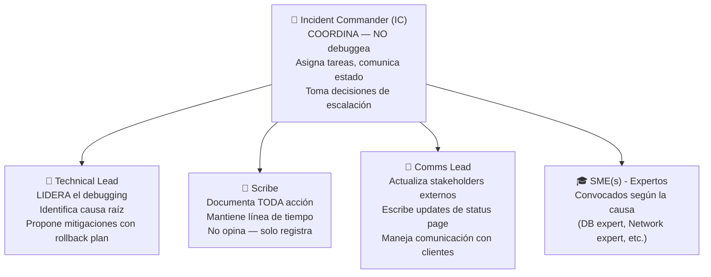

⚠️ **Error común crítico:** El IC no debe debuggear. Tan pronto como un ingeniero senior empieza a debuggear, pierde la vista global del incidente. El IC coordina. El Technical Lead debuggea. Son roles distintos y no deben mezclarse.

### 8.4 Plantillas de Comunicación

**Comunicación inicial en Slack (< 5 minutos de declaración del P0):**
```
🔴 [INCIDENTE P0 DECLARADO] — Autorizaciones Degradadas

📊 Estado: Degradado | ASR global: 72% (normal: 92%)
⏰ Inicio detectado: 14:32 UTC
🎯 IC: @nombre-del-ic | Tech Lead: @nombre-tech-lead
📍 Canal de trabajo: #incident-20240520-143200

Impacto conocido:
• Comercios afectados: múltiples (investigando alcance)
• Emisor sospechoso: Banco do Brasil (ASR = 0%)
• Error más frecuente: DE39=91 (Emisor no disponible)

Próximo update: 14:47 UTC
```

**Update de estado (cada 15 minutos):**
```
📊 [UPDATE P0 — 14:47 UTC]

Progreso: Causa raíz identificada — timeout hacia Banco do Brasil
Acción tomada: Activando STIP para BIN 45XXXX
ASR actual: 78% (mejorando desde 72%)
ETA resolución: ~15 minutos

Equipo trabajando: @a, @b, @c
Próximo update: 15:02 UTC
```

**Comunicación ejecutiva por correo:**
```
Asunto: [INCIDENTE P0 ACTIVO] — Degradación de Autorizaciones — Update 1

Estimado equipo ejecutivo:

Contexto: Estamos gestionando un incidente P0 desde las 14:32 UTC que afecta 
las autorizaciones de pago.

Impacto actual:
• ASR global: 72% (normal: 92%)
• Comercios afectados: aproximadamente 1,200 terminales activas
• Impacto económico estimado: ~$6,000 USD/minuto en comisiones

Causa identificada: Banco do Brasil (emisor) no responde en el tiempo esperado.
Mitigación aplicada: STIP activado para ese BIN. ASR recuperando.
ETA resolución: 15 minutos.

Próximo update: 15:00 UTC
—SRE Team
```

### 8.5 Checklist: Lo Que NUNCA Debe Hacerse

```
❌ Reiniciar servicios sin consenso del IC
   → Puede empeorar el problema o perder evidencia forense crítica

❌ No comunicar actualizaciones cada 15 minutos
   → El silencio genera más pánico que el incidente mismo

❌ Hacer cambios en producción sin rollback plan documentado
   → Cada mitigación debe tener un plan B explícito y documentado

❌ Asignar culpables durante el incidente
   → El blameless postmortem es después. Ahora: solo resolver

❌ Ignorar el runbook existente
   → Los runbooks existen porque alguien ya vivió este incidente antes

❌ Mezclar el rol de IC con debugging
   → El IC pierde visibilidad global. El incidente empeora

❌ Aplicar mitigaciones en paralelo sin coordinación
   → Hace imposible saber qué funcionó y qué empeoró la situación

❌ Cerrar el incidente sin confirmar métricas estabilizadas por > 10 minutos
   → Los incidentes se recuperan y vuelven a caer. Confirmar estabilidad
```

### 8.6 Postmortem Blameless — Plantilla Completa

```markdown
# Postmortem: [FECHA] — [Descripción Breve]

**Estado:** Borrador | En Revisión | Final
**Dueño:** [Nombre]
**Fecha del incidente:** YYYY-MM-DD HH:MM UTC
**Duración:** X horas Y minutos
**Severidad:** P0 / P1 / P2

## Resumen Ejecutivo (2-3 oraciones)
[Qué pasó, cuánto duró, cuál fue el impacto]

## Impacto
- **Duración:** [Tiempo desde detección hasta resolución]
- **Usuarios afectados:** [Número y descripción]
- **Transacciones fallidas:** [Número aproximado]
- **Impacto económico estimado:** [$ USD en comisiones perdidas]
- **SLO violado:** [Sí/No — cuánto error budget se consumió]
- **SLA violado:** [Sí/No — acciones contractuales requeridas]

## Línea de Tiempo (UTC)
| Hora | Evento |
|------|--------|
| HH:MM | Primer síntoma detectado |
| HH:MM | Alerta disparada en PagerDuty |
| HH:MM | On-call ACK la alerta |
| HH:MM | P0 declarado |
| HH:MM | IC nombrado |
| HH:MM | Primera hipótesis |
| HH:MM | Acción de mitigación X aplicada |
| HH:MM | Servicio restaurado |
| HH:MM | Incidente cerrado formalmente |

## Causa Raíz
[Explicación técnica detallada. Sin culpables: describir sistemas y procesos]

## Análisis de Causa Raíz — 5 Whys
1. **¿Por qué falló el servicio?** → ...
2. **¿Por qué existía esa condición?** → ...
3. **¿Por qué no lo detectamos antes?** → ...
4. **¿Por qué no teníamos alerta para esto?** → ...
5. **¿Por qué el proceso no lo previno?** → ...

## Lo Que Salió Bien
[No solo documentar lo malo. ¿Qué funcionó? ¿Qué aceleró la resolución?]

## Acciones — TODAS con Dueño y Fecha

| Prioridad | Acción | Dueño | Fecha Límite | Estado |
|---|---|---|---|---|
| 🔴 Inmediata | [Acción correctiva urgente] | [Nombre] | DD/MM/YYYY | Pendiente |
| 🟠 Corto plazo | [Mejora de alerta/monitoreo] | [Nombre] | DD/MM/YYYY | Pendiente |
| 🟡 Mediano plazo | [Mejora de proceso] | [Nombre] | DD/MM/YYYY | Pendiente |
| 🟢 Largo plazo | [Rediseño de componente] | [Nombre] | DD/MM/YYYY | Pendiente |
```

---

## 9. Incidentes Simulados — Casos de Estudio Reales

Estos incidentes no son hipotéticos: representan patrones reales de fallo que ocurren en sistemas de pagos en producción. Estudiarlos como casos reales es la forma más efectiva de desarrollar intuición operativa.

### Caso 1: El Emisor Silencioso

**Contexto:** Jueves 3:00 PM, hora pico en Brasil. El sistema procesa 8,000 TPS con distribución normal entre emisores.

**Secuencia de síntomas:**
```
14:58:00 - ASR global: 92% (normal)
14:58:45 - ASR global: 85% — burn rate sube
14:59:10 - Alerta: ASR por BIN 452345 (Banco do Brasil): 0%
14:59:15 - Alerta: Burn Rate > 14.4x — P0 declarado
14:59:30 - Logs: Connection timeout a socket 10.20.30.40:5500 después de 2500ms
```

**Diagnóstico:**
```promql
# Consulta que revela el problema:
sum by(issuer_name) (
  rate(auth_requests_total{status="timeout"}[5m])
) / sum by(issuer_name) (
  rate(auth_requests_total[5m])
)
# Resultado: Banco do Brasil = 100% timeout
```

**Decisión correcta:**
1. Activar STIP para BIN range 452345-452399 si los límites lo permiten
2. Comunicar al IC: "Banco do Brasil no responde. Activando STIP."
3. Contactar al NOC del emisor directamente
4. Monitorear STIP activations para detectar abuso

**Lo que NO hacer:**
- Cambiar el timeout de 2500ms a 5000ms (solo doblaría la latencia percibida)
- Reiniciar el switch de autorización (las otras transacciones se perderían)

**Lección clave:** La dependencia de terceros es el mayor riesgo en pagos. Los mecanismos de STIP deben estar pre-configurados y probados regularmente con game days. La comunicación proactiva con el emisor debe estar en el runbook.

---

### Caso 2: Tormenta de Reintentos — Black Friday

**Contexto:** Cyber Monday, 12:00 PM. Tráfico 3x el normal. Todo parece bajo control.

**Secuencia de síntomas:**
```
12:05:00 - TPS: 24,000 (3x normal) — esperado
12:06:30 - TPS: 240,000 (30x!) — patrón de diente de sierra
12:06:35 - DB: HIGH LOCK WAIT en tabla de transacciones
12:06:40 - Auth services: HTTP 503 Service Unavailable
12:06:45 - Alerta: P0 declarado
```

**Diagnóstico:**
```bash
# En los logs del switch: miles de líneas con el mismo STAN pero diferente timestamp
grep "STAN-999001" /var/log/auth-switch.log | wc -l
# Output: 18,432 líneas en 90 segundos — un solo comercio reintentando 200 TPS
```

**Causa raíz:** Un comercio con POS software mal configurado tenía retry interval = 500ms con retry limit = None. Al recibir el primer 503, entró en loop infinito.

**Decisión correcta:**
1. Identificar el terminal_id del comercio atacante: `DE 41`
2. Implementar rate limiting en el firewall: max 10 TPS por terminal_id
3. Contactar soporte del comercio para corregir configuración
4. Rechazar con DE39=75 (límite de reintentos) para ese terminal

**Lección clave:** Los clientes mal configurados pueden ser armas de destrucción masiva involuntaria. El rate limiting por cliente debe ser una capa de protección siempre activa, no solo en Black Friday.

---

### Caso 3: La Trampa del Año Nuevo — Desbordamiento del STAN

**Contexto:** 1 de enero, 00:01 AM. Todos están celebrando. El sistema empieza a fallar.

**Síntomas:**
```
00:01:00 - Tasa de error: 100% en TODAS las transacciones
00:01:00 - Sin timeouts — errores INMEDIATOS
00:01:00 - Logs: ERROR: duplicate key value violates unique constraint "transactions_pkey"
```

**Causa raíz:** El sistema generaba el STAN como un número de 6 dígitos secuencial que se reseteaba a 000001 cada día a medianoche. Al resetear, intentó insertar STAN-000001 que ya existía en la base de datos (la del año anterior no había sido archivada correctamente). Resultado: violación de clave primaria en el 100% de las transacciones.

**Decisión correcta:**
1. Hotfix inmediato: prefijo de año en la generación de STAN: `YYYYSTAN` = `2024000001`
2. O bien: incluir la fecha como parte de la clave primaria en la tabla de transacciones
3. Archivado urgente de las transacciones del año anterior

**Lección clave:** Los sistemas legacy tienen suposiciones temporales que se convierten en trampas explosivas. El testing de "boundary conditions" temporales (fin de día, fin de mes, fin de año, leap day) debe ser parte obligatoria del regression testing antes de cualquier período crítico.

---

### Caso 4: El Firewall que "Mejoraba" los Mensajes

**Contexto:** Migración de data center a la nube. Nuevo firewall corporativo instalado. Todo parece funcionar en las pruebas iniciales.

**Síntomas:**
```
Semana 1 post-migración: 0.1% de transacciones fallan con "MAC Invalid"
Síntomas intermitentes — difícil de reproducir
Checksums TCP/IP son correctos
El problema desaparece si se conecta directamente sin el firewall
```

**Diagnóstico:**
```bash
# Captura de paquetes antes y después del firewall
tcpdump -i eth0 -w before_fw.pcap dst host 10.20.30.40
tcpdump -i eth1 -w after_fw.pcap dst host 10.20.30.40

# Comparar los bytes exactos del campo DE 48
# Se detectó: algunos bytes del campo no crítico cambiaron en tránsito
```

**Causa raíz:** El nuevo firewall corporativo tenía activado Deep Packet Inspection (DPI) con un módulo de "normalización" de caracteres para tráfico financiero. Interpretaba algunos bytes del payload ISO 8583 como caracteres de texto y los "normalizaba" según reglas de encoding. Esto corrompía la firma MAC de los mensajes.

**Decisión correcta:**
1. Deshabilitar DPI para el puerto específico del tráfico de pagos
2. El tráfico ISO 8583 debe tratarse como datos binarios opacos
3. Documentar la configuración del firewall como parte del runbook de migración

**Lección clave:** Nunca asumir que la red es inocente. Todo intermediario de red (proxy, firewall, load balancer) es un sospechoso potencial cuando hay corrupción de datos a nivel de aplicación. Los mensajes ISO 8583 son datos binarios y deben ser tratados como tal.

---

### Caso 5: La Liquidación que No Cuadra — Incidente Silencioso

**Contexto:** Lunes 8:00 AM. Sin alertas técnicas. El equipo de finanzas reporta: el archivo de liquidación del domingo tiene una diferencia de $1,000,000 USD respecto a la base de datos.

**Este incidente es especialmente peligroso porque no hay alerta técnica. El sistema estaba "verde" en todos los dashboards.**

**Proceso de diagnóstico:**
```sql
-- Paso 1: Extraer suma total de transacciones aprobadas del domingo
SELECT SUM(amount) FROM transactions 
WHERE date = '2024-01-28' AND status = 'approved';
-- Resultado: $45,231,000

-- Paso 2: Sumar total del archivo de liquidación
-- (proceso manual o script de parsing)
-- Resultado: $44,231,000

-- Paso 3: Encontrar transacciones en BD pero no en archivo
SELECT t.transaction_id, t.amount 
FROM transactions t
LEFT JOIN settlement_file s ON t.transaction_id = s.transaction_id
WHERE t.date = '2024-01-28' 
AND t.status = 'approved' 
AND s.transaction_id IS NULL;
-- Resultado: 2,847 transacciones por $1,000,000 total
```

**Causa raíz:** Un bug en el proceso batch de liquidación: al encontrar un error de formato en UNA transacción del lote, el proceso abortaba silenciosamente la inclusión de TODAS las transacciones del lote. Sin alerta. Sin error en el log de nivel ERROR (solo en DEBUG, que nadie monitoreaba).

**Decisión correcta:**
1. Ejecutar proceso de conciliación manual
2. Generar archivo delta (complementario) para enviar a la cámara de compensación
3. Corregir el bug: error en una transacción no debe abortar el lote entero
4. Agregar alerta de calidad de datos: `abs(sum_transactions - sum_settlement_file) > $1000`

**Lección clave:** La confiabilidad no es solo "el sistema está arriba". Es también "los datos son correctos". Los procesos batch requieren monitoreo de calidad de datos, no solo de disponibilidad.

---

### Caso 6: El HSM que Se Quedó Sin Claves

**Contexto:** Miércoles 2:00 PM, hora valle. Sin cambios recientes en producción.

**Síntomas:**
```
14:00:00 - Primeros fallos: "MAC Invalid" y "PIN Verification Failed"
14:00:15 - ASR cae 15 puntos abruptamente
14:00:20 - Error rate en HSM: 100%
14:00:25 - Métrica hsm_keys_remaining: 0
14:00:30 - P1 declarado
```

**Causa raíz:** El HSM tiene un pool de claves de sesión con renovación automática configurada para hacerse cada 30 días. La renovación automática falló silenciosamente hace 3 semanas. Sin la alerta de "remaining_keys < 10%", nadie lo detectó hasta que el pool se agotó completamente.

**Decisión correcta:**
1. Iniciar rotación manual de emergencia de claves en el HSM
2. Verificar proceso de renovación automática y reparar
3. Implementar alerta: `hsm_keys_remaining / hsm_keys_total < 0.10`
4. Agregar game day mensual que consuma y regenere claves para validar el proceso

**Lección clave:** El HSM es un componente crítico que puede degradarse gradualmente sin caer. Monitorear métricas de capacidad (claves disponibles, sesiones activas) es tan importante como monitorear la disponibilidad del servicio.

---

## 10. Buenas Prácticas Profesionales

### 10.1 Cultura de Ingeniería SRE en Pagos

📌 **Principio #1: La confiabilidad es una feature de producto**
Un sistema que procesa pagos con 95% de éxito y el competidor lo hace al 99%, el competidor gana el contrato. La confiabilidad no es responsabilidad del equipo de infraestructura: es responsabilidad de toda la organización de ingeniería.

📌 **Principio #2: Error Budgets sobre instinto**
Cuando alguien dice "debería deployar esta feature importante", la respuesta correcta no es "creo que estamos bien". La respuesta correcta es "el error budget actual nos permite absorber X% de riesgo adicional. Avancemos / esperemos."

📌 **Principio #3: Toil reduction sistemático**
El trabajo manual repetitivo (toil) en un SRE es el mayor inhibidor de mejora. Automatizar primero lo que más duele: las tareas nocturnas, los deploys manuales, los runbooks de comandos repetitivos.

📌 **Principio #4: Blameless postmortems como cultura**
El objetivo de un postmortem no es encontrar al culpable: es encontrar cómo el sistema (técnico y organizacional) permitió que el incidente ocurriera. Los sistemas bien diseñados son resilientes a los errores humanos.

### 10.2 Reglas de Oro para NOC Operators

| # | Regla | Por Qué |
|---|---|---|
| 1 | Sigue el runbook antes de improvisar | Alguien ya vivió este incidente. Sus instrucciones están ahí |
| 2 | Documenta antes de actuar | Si algo sale mal, necesitas una línea de tiempo exacta |
| 3 | Comunica antes de que te pregunten | El silencio genera más ansiedad que el problema mismo |
| 4 | Escala temprano, nunca tarde | Escalar no es fracasar. Es usar los recursos correctos |
| 5 | Nunca apliques dos cambios simultáneos | Si algo empeora, no sabrás cuál de los dos fue |
| 6 | Siempre ten un rollback plan | Si la mitigación empeora el problema, ¿cómo vuelves atrás? |
| 7 | Verifica después de cada acción | Confirma que el cambio tuvo el efecto esperado |
| 8 | Preserva la evidencia forense | No reinicies servicios sin capturar logs y heap dumps primero |

### 10.3 Checklist de Inicio de Turno de Guardia

```
☐ Verificar alertas activas o pendientes de ACK
☐ Revisar el estado del error budget actual (¿estamos en riesgo?)
☐ Confirmar que los dashboards principales cargan correctamente
☐ Leer el handoff del turno anterior (¿hay situaciones en vigilancia?)
☐ Verificar cambios programados para mi turno (deploys, mantenimientos)
☐ Confirmar que la app de alertas funciona en mi teléfono
☐ Leer runbooks de los incidentes más recientes (actualizaciones)
☐ Verificar acceso a sistemas críticos (VPN, consolas, DB)
☐ Confirmar quién es el IC de backup si yo no puedo responder
☐ Tener el número del equipo de seguridad / fraud disponible
```

### 10.4 Gestión del Knowledge Base Técnico

Un NOC operator que documenta bien multiplica el valor de su experiencia. Cada incidente debe generar al menos una mejora en el runbook. El conocimiento que no está documentado muere cuando el ingeniero se va.

**Estructura de un runbook de calidad:**
```markdown
# Runbook: [Nombre del servicio / escenario]

## Cuándo usar este runbook
[Síntomas específicos que llevan aquí]

## Contexto del sistema
[Descripción breve del servicio]

## Pasos de diagnóstico
1. [Comando o acción específica]
   Resultado esperado: [...]
   Si no coincide: ir al paso X

## Pasos de mitigación
1. [Con rollback explícito]

## Escalación
Si los pasos anteriores no resuelven en [tiempo]: escalar a [equipo/persona]

## Historial de incidentes
| Fecha | STAN/ID | Causa | Resolución |
```

---

## 11. Problemas Comunes y Soluciones

### 11.1 Diagnóstico Sistemático por Síntoma

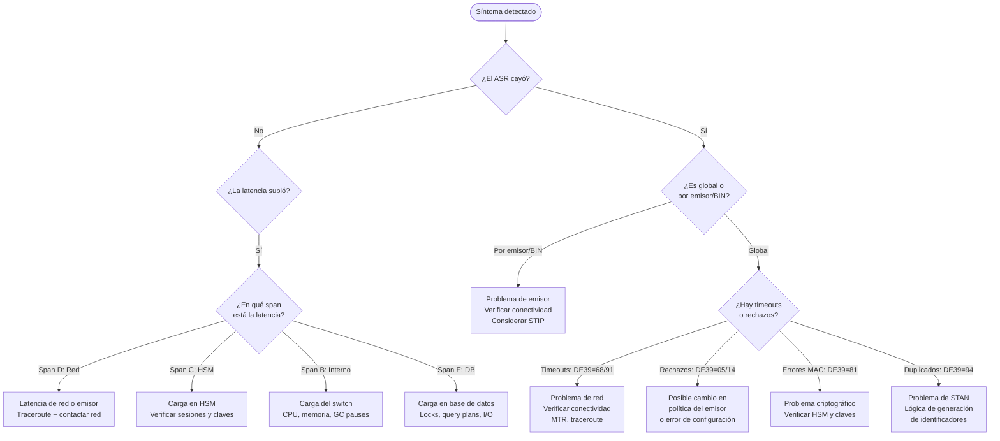

### 11.2 Tabla de Problemas, Causas y Soluciones

| Problema | Síntomas | Causas Comunes | Diagnóstico | Solución |
|---|---|---|---|---|
| Emisor no disponible | ASR↓ por BIN, DE39=91, timeouts | Mantenimiento emisor, problema de red, fallo del emisor | `ping` a IP del emisor, socket connect test | Activar STIP, contactar NOC del emisor |
| Tormenta de reintentos | TPS spike 10x, DB locks, 503 errors | POS mal configurado, bug en middleware | Logs: mismo STAN repetido miles de veces | Rate limit por terminal_id, contactar comercio |
| Clock skew | Transacciones rechazadas con DE39=80 | NTP desincronizado entre DCs | `date` en todos los nodos, comparar timestamps | Forzar sincronización NTP, revisar fuente NTP |
| MAC inválido | DE39=81, 86, 87, 88 | HSM con claves expiradas, DPI en firewall, bug en signing | Captura de paquetes antes/después de cada hop | Verificar HSM, deshabilitar DPI para el puerto |
| Liquidación no cuadra | Diferencia en sumas de conciliación | Bug en batch, error de redondeo, transacciones huérfanas | SQL de reconciliación: BD vs archivo | Proceso de conciliación manual, hotfix del batch |
| STAN duplicado | DE39=94 al procesar | Reset de STAN sin considerar transacciones previas, bug | Verificar lógica de generación de STAN | Agregar prefijo de fecha/año al STAN |
| HSM sin claves | MAC Invalid, PIN Failed masivos | Expiración de pool de claves sin renovación automática | Métrica `hsm_keys_remaining` | Rotación de emergencia de claves |
| Latencia P99 elevada | Timeout en POS sin causa aparente | GC pause en JVM, DB query plan regresión, network | Análisis de spans de tracing, GC logs | Tuning JVM, optimización de queries, escalar recursos |
| Datos de tarjeta en logs | Hallazgo en auditoría PCI | Log statement sin enmascaramiento | Grep en logs: `\b\d{16}\b` | Hotfix urgente, rotar logs, alertar al CISO |

---

## 12. Roadmap Profesional — De NOC a Staff SRE

### 12.1 La Progresión de Carrera en Pagos

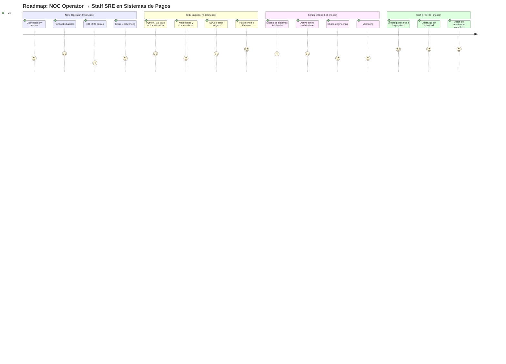

### 12.2 Mapa de Habilidades por Nivel

#### Beginner — NOC Operator (0-6 meses)

**Objetivo:** Pasar de reacción a comprensión sistémica.

| Área | Habilidades | Recursos |
|---|---|---|
| Monitoreo | Leer dashboards Grafana, interpretar alertas, seguir runbooks | Grafana tutorials, documentación interna |
| ISO 8583 | Entender MTI, conocer DE39 y DEs críticos, leer logs de transacciones | Especificación ISO 8583, guías Visa/MC |
| Linux | Comandos básicos, tail/grep en logs, top/htop | "The Linux Command Line" — W. Shotts |
| Networking | Conceptos TCP/IP, qué es un socket, qué es latencia | "Computer Networking: A Top-Down Approach" |
| Incidentes | Seguir runbooks, comunicar correctamente, escalar a tiempo | Runbooks internos, documentación de postmortems |

**Proyecto recomendado:** Mejorar un runbook existente con pasos más claros y agregar una sección de diagnóstico.

**Indicadores de progreso:**
- [ ] Puedo responder una alerta sin ayuda
- [ ] Puedo leer un log de transacción y decir qué pasó
- [ ] El equipo me consulta antes de escalar problemas básicos

---

#### Intermediate — SRE Engineer (6-18 meses)

**Objetivo:** Automatizar, observar y participar activamente en la confiabilidad.

| Área | Habilidades | Recursos |
|---|---|---|
| Programación | Python para scripts de análisis, Go para herramientas internas | "The Go Programming Language" — Donovan & Kernighan |
| Infraestructura | Kubernetes básico, Terraform, Docker | Kubernetes docs oficiales, HashiCorp Learn |
| Observabilidad | PromQL, Grafana dashboards, OpenTelemetry básico | Prometheus docs, "Prometheus: Up & Running" |
| SLOs | Definir SLIs, calcular error budgets, implementar burn rate alerts | "Site Reliability Engineering" — Google (online gratuito) |
| Postmortems | Participar como scribe, luego como contributor técnico | "The Site Reliability Workbook" — Google |

**Proyecto recomendado:** Construir un dashboard de ASR en tiempo real con alertas de burn rate. Automatizar la correlación de logs usando el STAN.

**Indicadores de progreso:**
- [ ] Tengo un script o herramienta usada por el equipo
- [ ] Definí al menos un SLO que fue adoptado
- [ ] Lideré la documentación de un postmortem

---

#### Advanced — Senior SRE (18-36 meses)

**Objetivo:** Diseñar sistemas resilientes y liderar la práctica de confiabilidad.

| Área | Habilidades | Recursos |
|---|---|---|
| Sistemas distribuidos | CAP theorem, consistencia eventual, circuit breakers, bulkheads | "Designing Data-Intensive Applications" — Kleppmann |
| Arquitectura | Active-active, STIP design, failover estratégico | Documentación de arquitecturas Visa/MC |
| Chaos Engineering | Game days, diseño de experimentos, análisis de resultados | "Chaos Engineering" — Casey Rosenthal |
| Liderazgo técnico | Technical Lead en incidentes P0, influencia en roadmap | "The Staff Engineer's Path" — Tanya Reilly |
| Seguridad | PCI DSS Req. 6, 10, 11, criptografía aplicada (HSM, EMV) | PCI DSS v4.0 official guide |

**Proyecto recomendado:** Diseñar e implementar una estrategia de chaos engineering para el sistema de autorización. Liderar un game day de fallo de emisor.

**Indicadores de progreso:**
- [ ] Diseñé una mejora de arquitectura que fue adoptada
- [ ] Lideré la respuesta técnica en un incidente P1 o P0
- [ ] El equipo me consulta antes de tomar decisiones de diseño

---

#### Expert — Staff SRE (36+ meses)

**Objetivo:** Definir la estrategia técnica de confiabilidad a largo plazo. Multiplicar el impacto a través de otros.

| Área | Habilidades | Recursos |
|---|---|---|
| Estrategia | Visión técnica a 2-3 años, roadmap de confiabilidad | "An Elegant Puzzle" — Will Larson |
| Arquitectura global | Multi-cloud, geo-distribution, active-active between continents | Architecture papers de Visa/SWIFT |
| Liderazgo | Mentoring estructurado, liderazgo sin autoridad, presentación a ejecutivos | "The Staff Engineer's Path" — Tanya Reilly |
| Ecosistema completo | Integración post-adquisición, evaluación de vendors, estándares de industria | PCI SSC standards, ISO 27001 |
| Comunidad | Contribuciones open source, presentaciones en conferencias | KubeCon, SREcon, Money20/20 |

**Proyecto recomendado:** Definir la estrategia de observabilidad para los próximos 3 años. Crear un programa formal de game days. Mentorear a dos ingenieros hacia el nivel Senior.

---

### 12.3 Plan de Acción — Próximos 30 Días (Para NOC Operators)

Si eres operador de NOC y quieres comenzar tu transición a SRE, este es el plan de acción mínimo viable:

| Semana | Acción | Tiempo Requerido | Entregable |
|---|---|---|---|
| 1 | Documentar 3 incidentes recientes como RCAs técnicos con 5 Whys | 3-4 horas/incidente | 3 documentos de RCA |
| 1 | Estudiar ISO 8583: leer la sección 3 de este documento completa | 2 horas | Poder explicar MTI y DE39 a un colega |
| 2 | Crear un script simple en Python que parsee logs y correlacione por STAN | 5-8 horas | Script funcional en GitHub interno |
| 2 | Medir y documentar las latencias reales del flujo de autorización | 2 horas | Baseline de latencias con percentiles |
| 3 | Proponer una mejora concreta de monitoreo (una alerta mejor, un dashboard) | 3 horas | Propuesta documentada en ticket |
| 3 | Leer "Site Reliability Engineering" cap. 1-5 (gratuito en Google) | 5 horas | Entender qué es y qué no es SRE |
| 4 | Presentar al equipo una propuesta de mejora basada en los incidentes analizados | 2-3 horas | Presentación de 10 minutos |

---

### 12.4 Tecnologías Recomendadas por Etapa

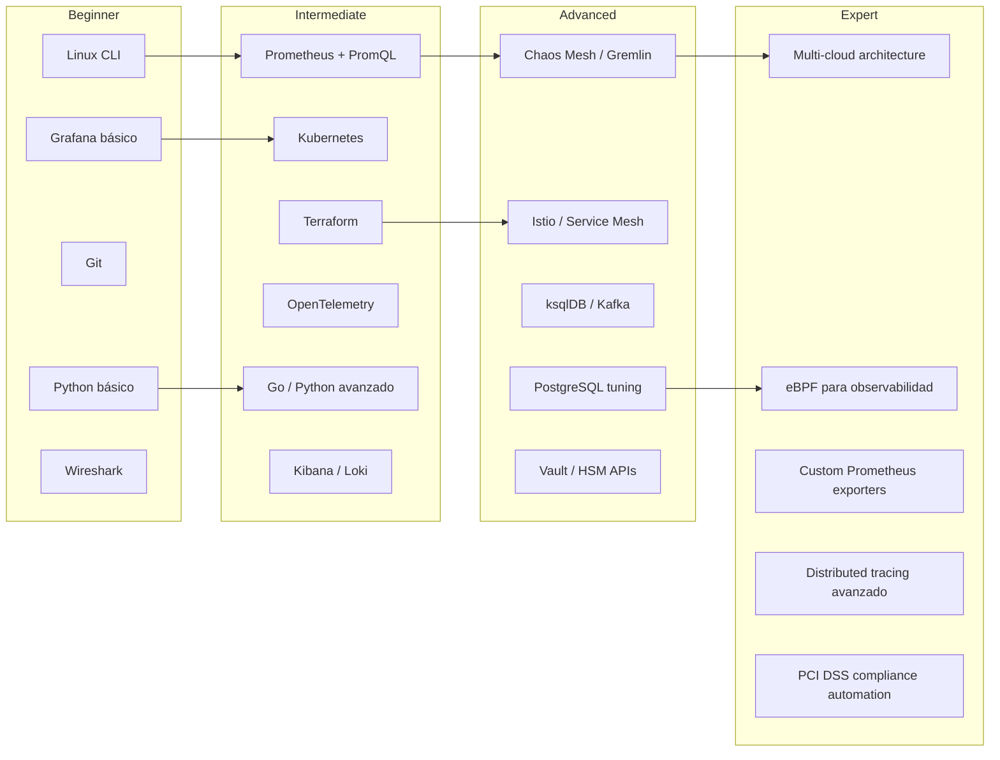

---

## 13. Glosario Técnico Consolidado

| Término | Definición | Contexto de Uso |
|---|---|---|
| **ACK (Acknowledge)** | Confirmación de recepción de una alerta de on-call | Proceso de incident response |
| **Active-Active** | Arquitectura donde múltiples instancias procesan tráfico simultáneamente | Diseño de alta disponibilidad |
| **ARPC** | Authorisation Response Cryptogram — respuesta criptográfica del emisor | Seguridad EMV |
| **ARQC** | Authorisation Request Cryptogram — firma criptográfica del chip | Seguridad EMV |
| **ASR** | Authorization Success Rate — porcentaje de transacciones aprobadas sobre total | Métrica SLI principal |
| **ATC** | Application Transaction Counter — contador de transacciones en el chip EMV | Detección de clonación |
| **Blameless Postmortem** | Análisis post-incidente enfocado en sistemas, no en culpables individuales | Cultura SRE |
| **BIN** | Bank Identification Number — primeros 6-8 dígitos del PAN, identifica al emisor | Routing de transacciones |
| **Burn Rate** | Velocidad a la que se consume el error budget | Gestión de SLOs |
| **Chaos Engineering** | Práctica de inyectar fallos controlados para probar resiliencia | Confiabilidad proactiva |
| **Circuit Breaker** | Patrón que abre el circuito ante exceso de errores para proteger el sistema | Resiliencia |
| **Clearing** | Proceso de reconciliación y compensación de transacciones entre instituciones | Fin de ciclo diario |
| **CVV/CVC** | Card Verification Value/Code — código de seguridad de la tarjeta | Autenticación de tarjeta |
| **DE** | Data Element — campo de datos en el protocolo ISO 8583 | Mensajería ISO 8583 |
| **DE39** | Response Code — campo de respuesta de autorización | Diagnóstico de transacciones |
| **EMV** | Estándar de tarjetas con chip (Europay-Mastercard-Visa) | Seguridad de transacciones |
| **Error Budget** | Margen de error permitido = (1 - SLO). Combustible para innovar | Gestión SRE |
| **Game Day** | Ejercicio planificado de simulación de fallos en producción | Chaos Engineering |
| **Gateway** | Componente que procesa pagos e-commerce y agrega seguridad (3DS) | Arquitectura |
| **HSM** | Hardware Security Module — dispositivo físico de gestión de claves criptográficas | Criptografía |
| **IC** | Incident Commander — rol que coordina sin debuggear durante un incidente | Incident response |
| **ISO 8583** | Estándar internacional para mensajes de transacciones financieras | Protocolo base |
| **MTBF** | Mean Time Between Failures — tiempo promedio entre fallos | Métricas de confiabilidad |
| **MTTR** | Mean Time To Recover — tiempo promedio para recuperar el servicio | Métricas de confiabilidad |
| **MTI** | Message Type Indicator — primeros 4 bytes de un mensaje ISO 8583 | Mensajería ISO 8583 |
| **NFC** | Near Field Communication — tecnología de pago sin contacto (contactless) | Formas de pago |
| **NOC** | Network Operations Center — centro de operaciones de red y sistemas | Rol operativo |
| **PAN** | Primary Account Number — número de tarjeta | Identificación |
| **PCI DSS** | Payment Card Industry Data Security Standard — estándar de seguridad | Cumplimiento normativo |
| **POS** | Point of Sale — terminal de punto de venta | Hardware |
| **PromQL** | Lenguaje de consulta de Prometheus para métricas de series temporales | Observabilidad |
| **RCA** | Root Cause Analysis — análisis de causa raíz | Postmortems |
| **RRN** | Retrieval Reference Number — referencia de recuperación de transacción | Conciliación |
| **Settlement** | Transferencia real de fondos entre instituciones financieras | Fin de ciclo |
| **SLA** | Service Level Agreement — contrato de nivel de servicio con el cliente | Legal/Negocio |
| **SLI** | Service Level Indicator — métrica real que se mide (ej: ASR) | Marco SRE |
| **SLO** | Service Level Objective — objetivo interno de confiabilidad | Marco SRE |
| **SRE** | Site Reliability Engineering — disciplina de ingeniería de confiabilidad | Rol/Disciplina |
| **STAN** | Systems Trace Audit Number — número de traza para correlación | Diagnóstico |
| **STIP** | Stand-In Processing — procesamiento alternativo cuando el emisor no responde | Alta disponibilidad |
| **Switch** | Sistema que enruta mensajes ISO 8583 entre adquirente y redes de pago | Arquitectura |
| **Toil** | Trabajo manual repetitivo que no agrega valor permanente | Cultura SRE |
| **TPS** | Transactions Per Second — transacciones por segundo | Métricas de volumen |
| **Track 1 / Track 2** | Datos de banda magnética de la tarjeta. NUNCA loguear | Seguridad PCI |
| **TVR** | Terminal Verification Results — resultado de verificación del chip en el terminal | Seguridad EMV |
| **War Room** | Sala (física o virtual) donde se concentra el equipo durante un incidente P0 | Incident response |

---

*Fin del Documento Maestro — La Guía Definitiva del NOC a SRE en Sistemas de Pagos Globales*

---

**Control de Versiones:**
| Versión | Fecha | Descripción | Autor |
|---|---|---|---|
| 1.0 | — | Versión inicial (Plan de Transición NOC→SRE) | Equipo original |
| 1.5 | — | Expansión técnica (El Libro Definitivo del SRE de Pagos) | Equipo SRE |
| 2.0 | Actual | Documento Maestro Integrado — fusión y expansión completa | SRE Payments Team |

**Próxima revisión programada:** Trimestral o después de cualquier incidente P0.
